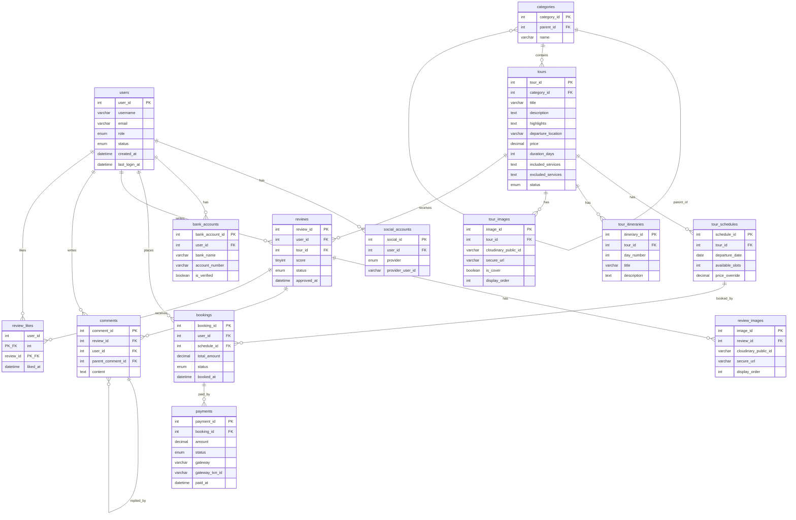

# Database Documentation

Tài liệu mô tả cấu trúc cơ sở dữ liệu của hệ thống đặt tour du lịch.

---

## Mục lục

- [Enums](#enums)
- [Domain: User](#domain-user)
- [Domain: Tour](#domain-tour)
- [Domain: Booking & Payment](#domain-booking--payment)
- [Domain: Reviews & Comments](#domain-reviews--comments)
- [Sơ đồ quan hệ (ERD)](#sơ-đồ-quan-hệ-erd)

---

## Enums

| Enum | Giá trị |
|------|---------|
| `user_role` | `admin`, `user` |
| `user_status` | `active`, `inactive`, `banned` |
| `social_provider` | `fb`, `twitter`, `google` |
| `tour_status` | `active`, `inactive` |
| `booking_status` | `pending`, `confirmed`, `cancelled`, `completed` |
| `payment_status` | `pending`, `success`, `failed`, `refunded` |
| `review_status` | `pending`, `approved`, `rejected` |
| `post_status` | `draft`, `published` |

---

## Domain: User

### `users`

Lưu thông tin tài khoản người dùng trong hệ thống.

| Cột | Kiểu | Ràng buộc | Mô tả |
|-----|------|-----------|-------|
| `user_id` | `int` | PK, AUTO_INCREMENT | Khóa chính |
| `username` | `varchar` | NOT NULL | Tên đăng nhập |
| `email` | `varchar` | NOT NULL, UNIQUE | Email đăng nhập |
| `password_hash` | `varchar` | NOT NULL | Mật khẩu đã hash |
| `role` | `enum` | NOT NULL, default `user` | Vai trò: `admin` / `user` |
| `status` | `enum` | NOT NULL, default `active` | Trạng thái: `active` / `inactive` / `banned` |
| `created_at` | `datetime` | NOT NULL, default `now()` | Thời điểm tạo tài khoản |
| `updated_at` | `datetime` | nullable | Thời điểm cập nhật gần nhất |
| `last_login_at` | `datetime` | nullable | Thời điểm đăng nhập gần nhất |

---

### `social_accounts`

Liên kết tài khoản mạng xã hội với người dùng (OAuth).

| Cột | Kiểu | Ràng buộc | Mô tả |
|-----|------|-----------|-------|
| `social_id` | `int` | PK, AUTO_INCREMENT | Khóa chính |
| `user_id` | `int` | FK → `users.user_id` (CASCADE DELETE) | Người dùng sở hữu |
| `provider` | `enum` | NOT NULL | Nhà cung cấp: `fb` / `twitter` / `google` |
| `provider_user_id` | `varchar` | NOT NULL | ID người dùng phía provider |
| `linked_at` | `datetime` | NOT NULL, default `now()` | Thời điểm liên kết |

---

### `bank_accounts`

Tài khoản ngân hàng của người dùng (dùng cho hoàn tiền, thanh toán).

| Cột | Kiểu | Ràng buộc | Mô tả |
|-----|------|-----------|-------|
| `bank_account_id` | `int` | PK, AUTO_INCREMENT | Khóa chính |
| `user_id` | `int` | FK → `users.user_id` (CASCADE DELETE) | Người dùng sở hữu |
| `bank_name` | `varchar` | NOT NULL | Tên ngân hàng |
| `account_number` | `varchar` | NOT NULL | Số tài khoản |
| `account_holder_name` | `varchar` | NOT NULL | Tên chủ tài khoản |
| `is_verified` | `boolean` | NOT NULL, default `false` | Đã xác thực chủ tài khoản hay chưa |
| `created_at` | `datetime` | NOT NULL, default `now()` | Thời điểm thêm tài khoản |

---

## Domain: Tour

### `categories`

Danh mục tour, hỗ trợ cấu trúc cây (danh mục cha–con).

| Cột | Kiểu | Ràng buộc | Mô tả |
|-----|------|-----------|-------|
| `category_id` | `int` | PK, AUTO_INCREMENT | Khóa chính |
| `parent_id` | `int` | FK → `categories.category_id` (SET NULL), nullable | Danh mục cha (null nếu là root) |
| `name` | `varchar` | NOT NULL | Tên danh mục |
| `created_at` | `datetime` | NOT NULL, default `now()` | Thời điểm tạo |
| `updated_at` | `datetime` | nullable | Thời điểm cập nhật |

---

### `tours`

Thông tin chính của một chuyến tour.

| Cột | Kiểu | Ràng buộc | Mô tả |
|-----|------|-----------|-------|
| `tour_id` | `int` | PK, AUTO_INCREMENT | Khóa chính |
| `category_id` | `int` | FK → `categories.category_id` (RESTRICT DELETE) | Danh mục tour |
| `title` | `varchar` | NOT NULL | Tên tour |
| `description` | `text` | nullable | Mô tả chi tiết tour |
| `highlights` | `text` | nullable | Điểm nổi bật |
| `departure_location` | `varchar` | nullable | Điểm khởi hành |
| `price` | `decimal(15,2)` | NOT NULL | Giá gốc tour |
| `duration_days` | `int` | NOT NULL | Số ngày của tour |
| `included_services` | `text` | nullable | Dịch vụ bao gồm |
| `excluded_services` | `text` | nullable | Dịch vụ không bao gồm |
| `status` | `enum` | NOT NULL, default `active` | Trạng thái: `active` / `inactive` |
| `created_at` | `datetime` | NOT NULL, default `now()` | Thời điểm tạo |
| `updated_at` | `datetime` | nullable | Thời điểm cập nhật |

---

### `tour_schedules`

Lịch khởi hành cụ thể của từng tour.

| Cột | Kiểu | Ràng buộc | Mô tả |
|-----|------|-----------|-------|
| `schedule_id` | `int` | PK, AUTO_INCREMENT | Khóa chính |
| `tour_id` | `int` | FK → `tours.tour_id` (CASCADE DELETE) | Tour tương ứng |
| `departure_date` | `date` | NOT NULL | Ngày khởi hành |
| `available_slots` | `int` | NOT NULL | Số chỗ còn trống |
| `price_override` | `decimal(15,2)` | nullable | Ghi đè giá gốc cho lịch này, `null` = dùng giá gốc từ `tours.price` |
| `created_at` | `datetime` | NOT NULL, default `now()` | Thời điểm tạo |
| `updated_at` | `datetime` | nullable | Thời điểm cập nhật |

> **Logic ứng dụng**: `final_price = schedule.price_override ?? tour.price`

---

### `tour_itineraries`

Lịch trình chi tiết từng ngày của tour.

| Cột | Kiểu | Ràng buộc | Mô tả |
|-----|------|-----------|-------|
| `itinerary_id` | `int` | PK, AUTO_INCREMENT | Khóa chính |
| `tour_id` | `int` | FK → `tours.tour_id` (CASCADE DELETE) | Tour tương ứng |
| `day_number` | `int` | NOT NULL | Ngày thứ mấy: 1, 2, 3... |
| `title` | `varchar` | NOT NULL | Tiêu đề ngày (VD: "Hà Nội – Sapa") |
| `description` | `text` | nullable | Mô tả chi tiết hoạt động trong ngày |
| `created_at` | `datetime` | NOT NULL, default `now()` | Thời điểm tạo |
| `updated_at` | `datetime` | nullable | Thời điểm cập nhật |

---

### `tour_images`

Ảnh của tour, lưu trữ trên Cloudinary.

| Cột | Kiểu | Ràng buộc | Mô tả |
|-----|------|-----------|-------|
| `image_id` | `int` | PK, AUTO_INCREMENT | Khóa chính |
| `tour_id` | `int` | FK → `tours.tour_id` (CASCADE DELETE) | Tour chứa ảnh |
| `cloudinary_public_id` | `varchar` | NOT NULL | Dùng để xóa/transform ảnh qua Cloudinary API |
| `secure_url` | `varchar` | NOT NULL | HTTPS CDN URL để hiển thị |
| `format` | `varchar` | NOT NULL | Định dạng: jpg / png / webp / ... |
| `width` | `int` | NOT NULL | Chiều rộng (px) |
| `height` | `int` | NOT NULL | Chiều cao (px) |
| `bytes` | `int` | NOT NULL | Kích thước file (bytes) |
| `is_cover` | `boolean` | NOT NULL, default `false` | Ảnh đại diện / thumbnail của tour |
| `display_order` | `int` | NOT NULL, default `0` | Thứ tự hiển thị trong gallery |
| `created_at` | `datetime` | NOT NULL, default `now()` | Thời điểm upload |

---

## Domain: Booking & Payment

### `bookings`

Đơn đặt tour của người dùng.

| Cột | Kiểu | Ràng buộc | Mô tả |
|-----|------|-----------|-------|
| `booking_id` | `int` | PK, AUTO_INCREMENT | Khóa chính |
| `user_id` | `int` | FK → `users.user_id` (RESTRICT DELETE) | Người đặt tour |
| `schedule_id` | `int` | FK → `tour_schedules.schedule_id` (RESTRICT DELETE) | Lịch khởi hành được đặt |
| `total_amount` | `decimal(15,2)` | NOT NULL | Tổng tiền của đơn |
| `status` | `enum` | NOT NULL, default `pending` | Trạng thái: `pending` / `confirmed` / `cancelled` / `completed` |
| `booked_at` | `datetime` | NOT NULL, default `now()` | Thời điểm đặt |
| `confirmed_at` | `datetime` | nullable | Thời điểm xác nhận |
| `cancelled_at` | `datetime` | nullable | Thời điểm hủy |
| `updated_at` | `datetime` | nullable | Thời điểm cập nhật |

---

### `payments`

Giao dịch thanh toán cho một đơn đặt tour.

| Cột | Kiểu | Ràng buộc | Mô tả |
|-----|------|-----------|-------|
| `payment_id` | `int` | PK, AUTO_INCREMENT | Khóa chính |
| `booking_id` | `int` | FK → `bookings.booking_id` (CASCADE DELETE) | Đơn đặt tương ứng |
| `amount` | `decimal(15,2)` | NOT NULL | Số tiền thanh toán |
| `status` | `enum` | NOT NULL, default `pending` | Trạng thái: `pending` / `success` / `failed` / `refunded` |
| `gateway` | `varchar` | NOT NULL | Cổng thanh toán: vnpay / onepay / napas / ... |
| `gateway_txn_id` | `varchar` | nullable | Mã giao dịch phía cổng thanh toán, dùng để đối soát |
| `created_at` | `datetime` | NOT NULL, default `now()` | Thời điểm khởi tạo thanh toán |
| `paid_at` | `datetime` | nullable | Thời điểm thanh toán thành công |

---

## Domain: Reviews & Comments

### `reviews`

Bài đánh giá + chấm điểm của người dùng về tour (có kiểm duyệt). Gộp cả review text và rating (1–5 sao) trong cùng một bản ghi.

| Cột | Kiểu | Ràng buộc | Mô tả |
|-----|------|-----------|-------|
| `review_id` | `int` | PK, AUTO_INCREMENT | Khóa chính |
| `user_id` | `int` | FK → `users.user_id` (CASCADE DELETE) | Người viết review |
| `tour_id` | `int` | FK → `tours.tour_id` (CASCADE DELETE) | Tour được đánh giá |
| `score` | `tinyint unsigned` | nullable | Điểm sao 1–5, nullable nếu chỉ viết review không chấm điểm |
| `status` | `enum` | NOT NULL, default `pending` | Trạng thái duyệt: `pending` / `approved` / `rejected` |
| `created_at` | `datetime` | NOT NULL, default `now()` | Thời điểm viết |
| `updated_at` | `datetime` | nullable | Thời điểm chỉnh sửa |
| `approved_at` | `datetime` | nullable | Thời điểm được duyệt |

---

### `review_images`

Ảnh đính kèm trong bài review, lưu trữ trên Cloudinary.

| Cột | Kiểu | Ràng buộc | Mô tả |
|-----|------|-----------|-------|
| `image_id` | `int` | PK, AUTO_INCREMENT | Khóa chính |
| `review_id` | `int` | FK → `reviews.review_id` (CASCADE DELETE) | Review chứa ảnh |
| `cloudinary_public_id` | `varchar` | NOT NULL | Dùng để xóa/transform ảnh qua Cloudinary API |
| `secure_url` | `varchar` | NOT NULL | HTTPS CDN URL để hiển thị |
| `format` | `varchar` | NOT NULL | Định dạng: jpg / png / webp / ... |
| `width` | `int` | NOT NULL | Chiều rộng (px) |
| `height` | `int` | NOT NULL | Chiều cao (px) |
| `bytes` | `int` | NOT NULL | Kích thước file (bytes) |
| `display_order` | `int` | NOT NULL, default `0` | Thứ tự hiển thị trong gallery |
| `created_at` | `datetime` | NOT NULL, default `now()` | Thời điểm upload |

---

### `comments`

Bình luận trong một bài review, hỗ trợ reply lồng nhau.

| Cột | Kiểu | Ràng buộc | Mô tả |
|-----|------|-----------|-------|
| `comment_id` | `int` | PK, AUTO_INCREMENT | Khóa chính |
| `review_id` | `int` | FK → `reviews.review_id` (CASCADE DELETE) | Review chứa comment |
| `user_id` | `int` | FK → `users.user_id` (CASCADE DELETE) | Người bình luận |
| `parent_comment_id` | `int` | FK → `comments.comment_id` (SET NULL), nullable | Comment cha (null nếu là root comment) |
| `content` | `text` | NOT NULL | Nội dung bình luận |
| `created_at` | `datetime` | NOT NULL, default `now()` | Thời điểm bình luận |
| `updated_at` | `datetime` | nullable | Thời điểm chỉnh sửa |

---

### `review_likes`

Lượt thích của người dùng cho bài review (composite PK).

| Cột | Kiểu | Ràng buộc | Mô tả |
|-----|------|-----------|-------|
| `user_id` | `int` | PK, FK → `users.user_id` (CASCADE DELETE) | Người thích |
| `review_id` | `int` | PK, FK → `reviews.review_id` (CASCADE DELETE) | Review được thích |
| `liked_at` | `datetime` | NOT NULL, default `now()` | Thời điểm thích |

> **Composite Primary Key**: `(user_id, review_id)` — đảm bảo mỗi người chỉ like một review một lần.

---

## Sơ đồ quan hệ (ERD)

